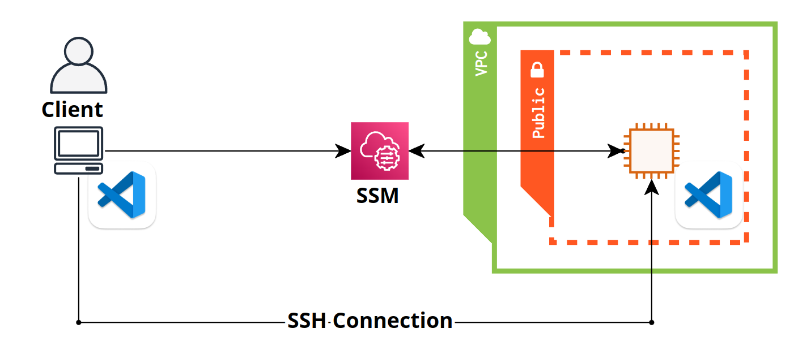

# VSCode Dev Containers を利用した AWS EC2 での開発環境構築手順

本リポジトリでは，Windows・Linux PC上の Visual Studio Code IDE (VSCode) から AWS EC2 へリモート接続し，VSCode Dev Containers を利用して深層学習やLLM ソフトウェア開発を効率良く行えるようにするための手順を示す．
なお，本リポジトリはチーム開発時に，所属チームへクラウドネイティブで効率的な開発手法を導入することを目的としており，python コーディングにおける linter, formatter や VSCode extension，setting.json なども共通のものを利用するようにしている．

## 目次

- [背景と課題](#背景と課題)
- [解決したいこと](#解決したいこと)
- [解決方法](#解決方法)
- [オリジナリティ](#オリジナリティ)
- [前提](#前提)
- [手順](#手順)
- [手順の各ステップの詳細](#手順の各ステップの詳細)
  - [1. AWS CLI のインストールとセットアップ](#1-aws-cli-のインストールとセットアップ)
  - [2. SSM Session Manager plugin のインストール](#2-ssm-session-manager-plugin-のインストール)
  - [3. ローカルの VSCode に extension をインストール](#3-ローカルの-vscode-に-extension-をインストール)
  - [4. CloudFormation で EC2 を構築](#4-cloudformation-で-ec2-を構築)
    - [構築するリソース](#構築するリソース)
    - [EC2の環境について](#ec2の環境について)
    - [cfテンプレートの簡易説明](#cfテンプレートの簡易説明)
  - [5. SSHの設定](#5-sshの設定)
  - [6. VSCode から EC2 インスタンスにログイン](#6-vscode-から-ec2-インスタンスにログイン)
  - [7. EC2 インスタンスに VSCode extension をインストール](#7-ec2-インスタンスに-vscode-extension-をインストール)
  - [8. Dev Containers と AWS Deep Learning Containers Imagesを利用したコンテナの構築](#8-dev-containers-と-aws-deep-learning-containers-imagesを利用したコンテナの構築)
- [その他](#その他)
  - [インスタンスの起動・停止](#インスタンスの起動停止)
  - [コーディングガイドラインと開発環境の設定](#コーディングガイドラインと開発環境の設定)
  - [チームでのEC2の運用・管理](#チームでのec2の運用管理)
- [参考](#参考)

## 背景と課題

社内プロキシが存在し，AWSのクラウドコンピューティングに容易にSSH接続して開発を行えない企業では，AWS Cloud9のようなクラウドネイティブIDEを利用してチーム開発を行うことがしばしば存在しうる．Cloud9 ベースの開発の場合，Linter の設定を自由に行えないため，コード内のバグ原因などの見落としが発生し，結果的に開発効率が悪くなると思われる．加えて，Gitコマンド，Dockerコマンド，Linux 基盤の深い知見を求められるため，新規参画者には敷居が高く，即時参画には時間を要してしまう問題がある．(cloud9 ではデフォルトで pylint (formatter)を利用できるが，その設定などは煩雑で，手動で開発者が各々行う必要がある．)

## 解決したいこと

チーム開発でVSCodeを利用し，Linter・Formatter を統一することで，チームとしてのコーディングスタイルの統一化，コードの可動性向上，無駄な Git Commit の削減を狙う．また，難解な docker コマンド，Git コマンドを利用せずに容易にコンテナ上での開発や，GUI ベースの Git 運用をできるようにし，効率良く DevOps を回せるようにする．これにより，開発者の開発効率の向上・新規参画者への引き継ぎ工数を最小化することができる．

## 解決方法

ローカルPC上のVSCodeから，VSCode Remote SSHで，SSM Session Manager Plugin経由でEC2インスタンスにログインできるようにする．また，VSCode Dev Containers を利用し，開発環境（コンテナ，Linter，Formatter，IDEの設定）を共通化する．



## オリジナリティ

[AWS Deep Learning Containers Images](https://github.com/aws/deep-learning-containers/blob/master/available_images.md)をベースに，VSCode Dev Containersを利用して，VSCode上での開発を可能にしている．SageMaker Pipelineの開発やSageMaker Training Jobの実行のみならず，深層学習，LLMモデル実行のための環境を迅速に構築することができる．

## 前提

Windows，Linux上には VScode は install されているものとする．加え，AWSユーザーは作成済みであり，Administrator相当の権限を保持していることを想定している．なお，手順書中では，Windowsでのセットアップに主眼を起き記述している．（Linuxでも同様の手順で実施可能．）

## 手順

1. AWS CLI のインストールとセットアップ
2. SSM Session Manager plugin のインストール
3. ローカルの VSCode に extension をインストール
4. CloudFormation で，EC2 を構築
5. SSHの設定
6. VSCode から Remote SSH 接続し，EC2 インスタンスにログイン
7. EC2 インスタンスに VSCode extension をインストール
8. Dev Containers と AWS Deep Learning Containers Imagesを利用したコンテナの構築

## 手順の各ステップの詳細

### 1. AWS CLI のインストールとセットアップ

公式ドキュメント[^1] [^2]を参考に，AWS CLI をインストール，セットアップする．

- [Windows 用の AWS CLI MSI インストーラ (64 ビット)](https://awscli.amazonaws.com/AWSCLIV2.msi) をダウンロードして実行する
- インストール後，`aws --version`でバージョンが表示されれば OK
- `aws configure`を実行し，AWS CLI の設定を行う
```
AWS Access Key ID [None]: IAM ユーザーの作成時にダウンロードした csv ファイルに記載
AWS Secret Access Key [None]: IAM ユーザーの作成時にダウンロードした csv ファイルに記載
Default region name [None]: ap-northeast-1
Default output format [None]: json
```
- Zscalerなどの社内プロキシを利用している場合は，`.aws/config`に以下を追記する．例えば，Zscalerを利用している場合は，以下のようにCA 証明書のフルパスを記述する．CA 証明書のエクスポート方法は後述するので，必要があれば適宜参考にされたい．．

```
ca_bundle = C:\path\to\zscalar_root_cacert.cer
```

<details>
<summary>※Zscaler CA 証明書のエクスポート方法</summary>
<br/>

公式ドキュメント[^3]を参考に，エクスポートする．

- コンピュータ証明書の管理 > 信頼されたルート証明機関 > 証明書
- Zscalar Root CA を左クリック > すべてのタスク > エクスポート
  - 証明書のエクスポートウィザードで、次へ > Base 64 encoded X.509 を選択して次へ
  - 参照 > ディレクトリ・ファイル名を入力（ここではファイル名を`zscalar_root_cacert.cer`とする）> 次へ > 完了 > OK

</details>
<br/>

### 2. SSM Session Manager plugin のインストール

公式ドキュメント[^4]を参考に，SSM Session Manager plugin をインストールする．
- [Session Manager プラグインのインストーラ](https://s3.amazonaws.com/session-manager-downloads/plugin/latest/windows/SessionManagerPluginSetup.exe)をダウンロードし実行する

### 3. ローカルの VSCode に extension をインストール

`./setup/vscode/vscode_local_setup_win.bat`を実行し，VSCodeのextensionを一括インストールする．Linux の場合は，`./setup/vscode/vscode_local_setup_linux.sh`を実行する．本バッチファイル，またはshellの実行により，以下のextensionがインストールされる．

- vscode-remote-extensionpack: VSCodeでリモート開発を行うためのextension
- aws-toolkit-vscode: AWSの各種サービスをVSCodeから操作するためのextension
- ec2-farm: AWSアカウント内のEC2インスタンスの状態を確認し，起動・停止・再起動を行うためのextension

### 4. CloudFormation で EC2 を構築

`./setup/cf-template/cf-ec2.yaml`（cfテンプレート）を利用し，CloudFormation で EC2 を構築する．以下に実際に構築されるリソースと，cfテンプレートの簡易説明を行う．また，CloudFormation の詳細な実行方法は後述しているので，必要があれば適宜参考にされたい．

#### 構築するリソース

- EC2
- EC2 Key pair
- Security Group


#### EC2の環境について

Deep Learning用のAMIを利用しているため，以下が全てインストールされている状態で EC2 が構築される．
- Git
- Docker
- NVIDIA Container Toolkit
- NVIDIA ドライバー
- CUDAおよびcuDNN, Pytorch

#### cfテンプレートの簡易説明

- VPC とサブネットの ID をユーザー側で記述する必要がある
  - default vpc のパブリックサブネット等を選択すれば良い
- EC2へのリモートアクセス・開発に必要と想定されるポリシーをアタッチしたロールは自動作成される．以下のポリシーをアタッチしている．
  - AmazonSSMManagedInstanceCore
  - AmazonS3FullAccess
  - AWSCodeCommitFullAccess
  - EC2InstanceProfileForImageBuilderECRContainerBuilds
  - AmazonSageMakerFullAccess
  - SecretsManagerReadWrite
  - AWSLambda_FullAccess
- セキュリティグループも自動作成しており，インバウンドは全てシャットアウトしている
- SSH 接続で利用する Key Pair を作成している
- EC2インスタンス作成時，以下を自動実行している
  - gitのアップグレード
  - aws cli のアップグレード
  - condaの初期設定
  - 再起動
- CloudFormationの出力部には，インスタンス ID と Key ID を出力している
  - 後述の shell で利用する

<details>
<summary>※CloudFormation 実行手順</summary>
<br/>

- [CloudFormationコンソール](https://console.aws.amazon.com/cloudformation/)を開き，スタックの作成を押下
- テンプレートの指定 > テンプレートファイルのアップロード > ファイルの選択で上記で作成したyamlファイルを指定し，次へを押下
  - `./setup/cf-template/cf-ec2.yaml`をuploadする．
- 任意のスタック名を入力後，以下のパラメータを設定する
  - EC2InstanceType: インスタンスタイプ．デフォルトはg4dn.xlarge
  - VolumeSize: ボリュームサイズ．デフォルトは100GB
  - ImageId: AMIのID．デフォルトはDeep Learning AMI GPU PyTorch 2.0.1のID
  - VPCId: 利用するVPCのID（デフォルトVPCのID等で問題ない）
  - SubnetID: 利用するパブリックサブネットのID（デフォルトVPCのパブリックサブネットID等で問題ない）
  
- 適切なIAM Roleをアタッチし，次へを押下（一時的にAdmin roleで実施しても良いかもしれない）
- 作成されるまで30秒~1分ほど待つ

</details>
<br/>

### 5. SSHの設定

`./setup/get_aws_keypair/get_key_win.bat`を実行し，秘密鍵のダウンロードと`.ssh/config`の設定を自動実行する．Linuxの場合は`./setup/get_aws_keypair/get_key_linux.sh`を実行すること．なお，実行前に．ソースコードの変数`KEY_ID`と`INSTANCE_ID`にはCloudFormationの実行結果の各値を記述すること．

### 6. VSCode から EC2 インスタンスにログイン

VSCodeのリモート接続機能を利用して，SSM Session Manager Plugin経由でEC2インスタンスにSSHでログインする．

- VSCode上で，`F1`を押下し，`Remote-SSH: Connect to Host...`を選択
- `~/.ssh/config`に記述したホスト名を選択（デフォルトでは`ec2`となっている）
- リモート側の初期設定が終わるまで30秒程度待つ．（Select the platform of the remtoe host "ec2" という画面が出たら`Linux`を選択すること）
  - ※スタックの作成が完了しても，cfテンプレート内のUserDataのshell実行が終わるまで待つ必要があるため注意．（最長5分~10分程度待つ．UserDataの実行ログは`/var/log/cloud-init-output.log`で確認できる．）
- EC2インスタンスにログイン後，インスタンス上に本リポジトリをcloneする．
- `conda activate pytorch`実行後，`./setup/check_vm_env/check_cuda_torch.sh`を実行し，EC2インスタンス上でGPUやpytorchが利用可能であることを確認する．以下のような出力が表示されるはず．
  - pytorchを利用したMNISTの画像分類の学習を行うスクリプト`./setup/check_vm_env/mnist_example/mnist.py`を用意しているため，これを実行しても構わない．

```
==============check cuda==============
nvcc: NVIDIA (R) Cuda compiler driver
Copyright (c) 2005-2023 NVIDIA Corporation
Built on Mon_Apr__3_17:16:06_PDT_2023
Cuda compilation tools, release 12.1, V12.1.105
Build cuda_12.1.r12.1/compiler.32688072_0
==============check gpu==============
Sat Dec 30 08:28:59 2023       
+---------------------------------------------------------------------------------------+
| NVIDIA-SMI 535.104.12             Driver Version: 535.104.12   CUDA Version: 12.2     |
|-----------------------------------------+----------------------+----------------------+
| GPU  Name                 Persistence-M | Bus-Id        Disp.A | Volatile Uncorr. ECC |
| Fan  Temp   Perf          Pwr:Usage/Cap |         Memory-Usage | GPU-Util  Compute M. |
|                                         |                      |               MIG M. |
|=========================================+======================+======================|
|   0  Tesla T4                       On  | 00000000:00:1E.0 Off |                    0 |
| N/A   31C    P8               9W /  70W |      0MiB / 15360MiB |      0%      Default |
|                                         |                      |                  N/A |
+-----------------------------------------+----------------------+----------------------+
                                                                                         
+---------------------------------------------------------------------------------------+
| Processes:                                                                            |
|  GPU   GI   CI        PID   Type   Process name                            GPU Memory |
|        ID   ID                                                             Usage      |
|=======================================================================================|
|  No running processes found                                                           |
+---------------------------------------------------------------------------------------+
==============check torch==============
if you exec at first time, you might wait for a while...
torch.__version__: 2.1.0
torch.cuda.is_available(): True
```

### 7. EC2 インスタンスに VSCode extension をインストール

- `./setup/vscode/vscode_vm_setup.sh`を実行し，EC2 インスタンス上で Gitの初期設定とVSCode extension のインストールを行う．なお，コード中の`NAME`と`MAIL`には，各自の名前とメールアドレスを記述すること．

### 8. Dev Containers と AWS Deep Learning Containers Imagesを利用したコンテナの構築

VSCode DevContainersと [AWS Deep Learning Containers Images](https://github.com/aws/deep-learning-containers/blob/master/available_images.md)を利用し，コンテナを構築する．`./.devcontainer/devcontainer.json`のinitializeCommandでECRのログインを行うことで，[AWS Deep Learning Containers Images](https://github.com/aws/deep-learning-containers/blob/master/available_images.md)（AWSのカスタムイメージ）をpullしている．[AWS Deep Learning Containers Images](https://github.com/aws/deep-learning-containers/blob/master/available_images.md)では，Pytorch, Tensorflow, MXNetなどのフレームワークがpre-installされたイメージ（SageMaker Training Jobでの実行環境イメージ）に加え，HuggingFace，StabilityAI のモデルの推論のためのイメージが提供されており，利用イメージを適宜変更・カスタマイズすることで検証時の環境構築を効率化することができる．

- VSCode上で，`F1`を押下し，`Dev Container: Reopen in Container`を選択し，Dev Containers を構築
  - `./.devcontainer/devcontainer.json`の`pj-name`という箇所には，各自のプロジェクト名を記述すること．
  - 初回のコンテナ構築時は，Dockerイメージのpullに時間がかかるため，10分~20分程度待つ．
- `./setup/check_vm_env/check_cuda_torch.sh`を実行し，コンテナ内でGPUやpytorchが利用可能であることを確認する．本リポジトリの設定だと以下のように表示される．


```
==============check cuda==============
nvcc: NVIDIA (R) Cuda compiler driver
Copyright (c) 2005-2023 NVIDIA Corporation
Built on Mon_Apr__3_17:16:06_PDT_2023
Cuda compilation tools, release 12.1, V12.1.105
Build cuda_12.1.r12.1/compiler.32688072_0
==============check gpu==============
Sat Dec 30 08:12:03 2023       
+---------------------------------------------------------------------------------------+
| NVIDIA-SMI 535.104.12             Driver Version: 535.104.12   CUDA Version: 12.2     |
|-----------------------------------------+----------------------+----------------------+
| GPU  Name                 Persistence-M | Bus-Id        Disp.A | Volatile Uncorr. ECC |
| Fan  Temp   Perf          Pwr:Usage/Cap |         Memory-Usage | GPU-Util  Compute M. |
|                                         |                      |               MIG M. |
|=========================================+======================+======================|
|   0  Tesla T4                       On  | 00000000:00:1E.0 Off |                    0 |
| N/A   31C    P8               9W /  70W |      0MiB / 15360MiB |      0%      Default |
|                                         |                      |                  N/A |
+-----------------------------------------+----------------------+----------------------+
                                                                                         
+---------------------------------------------------------------------------------------+
| Processes:                                                                            |
|  GPU   GI   CI        PID   Type   Process name                            GPU Memory |
|        ID   ID                                                             Usage      |
|=======================================================================================|
|  No running processes found                                                           |
+---------------------------------------------------------------------------------------+
==============check torch==============
if you exec at first time, you might wait for a while...
torch.__version__: 2.1.0
torch.cuda.is_available(): True
```

## その他

### インスタンスの起動・停止

開発開始時・終了時には，VSCode extension `EC2 Farm`経由で各々の EC2 インスタンスを起動・停止することが可能である．（AWSコンソールを開く必要はない．）

### コーディングガイドラインと開発環境の設定

チーム開発において VSCode を利用するメリットは，Linter や Formatter をチームで共通化できる上，IDE の設定や利用する extension なども共通化することができる点である．これにより，チームメンバ間での利用するツールやコーディング上の認識齟齬は低減され，利便性の高い extension によって開発効率が向上すると考えられる．詳細は，[./docs/coding-guidelines.md](https://github.com/Renya-Kujirada/aws-ec2-devkit-vscode/blob/main/docs/coding-guidelines.md)を参照されたい．

### チームでのEC2の運用・管理

インスタンスの切り忘れ防止のために，AWS Lambdaを利用して，夜12時に全てのEC2インスタンスを停止させている．なお，運用サーバーなど特定のインスタンスは除外可能にできるようにしている．詳細は，[./docs/operation_ec2.md](https://github.com/Renya-Kujirada/aws-ec2-devkit-vscode/blob/main/docs/operation_ec2.md)を参照されたい．

## 参考

[^1]:[AWS CLI の最新バージョンを使用してインストールまたは更新を行う](https://docs.aws.amazon.com/ja_jp/cli/latest/userguide/getting-started-install.html)
[^2]:[AWS CLI をセットアップする](https://docs.aws.amazon.com/ja_jp/cli/latest/userguide/getting-started-quickstart.html)
[^3]:[CA証明書のエクスポート](https://help.zscaler.com/ja/deception/exporting-root-ca-certificate-active-directory-certificate-service)
[^4]:[Windows での Session Manager プラグインのインストール](https://docs.aws.amazon.com/ja_jp/systems-manager/latest/userguide/install-plugin-windows.html)
